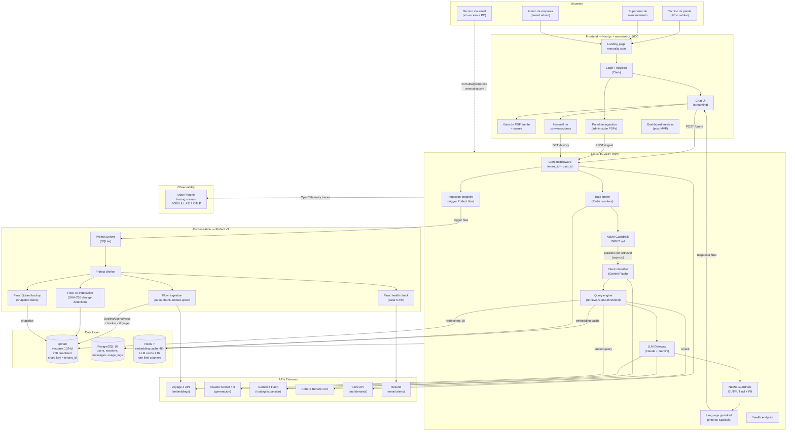
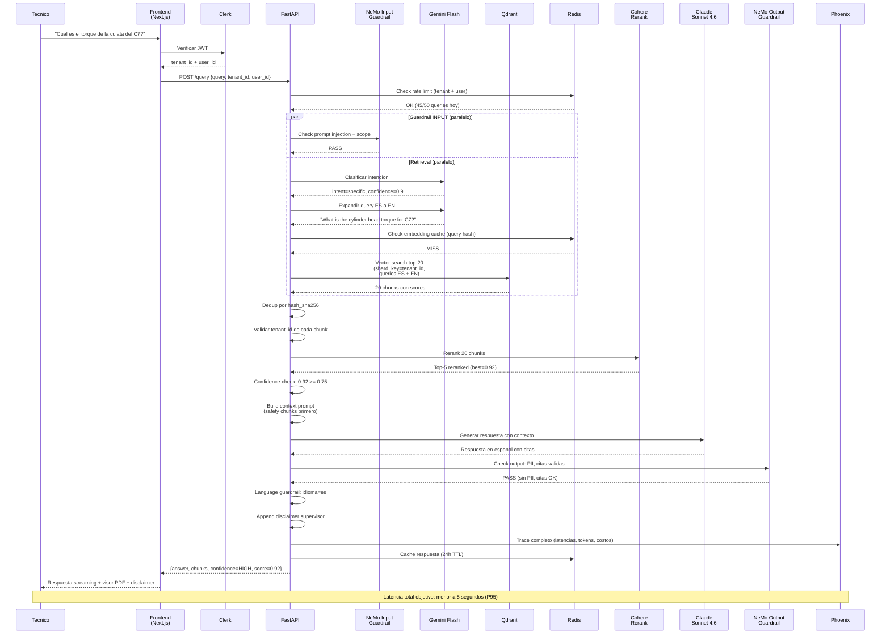
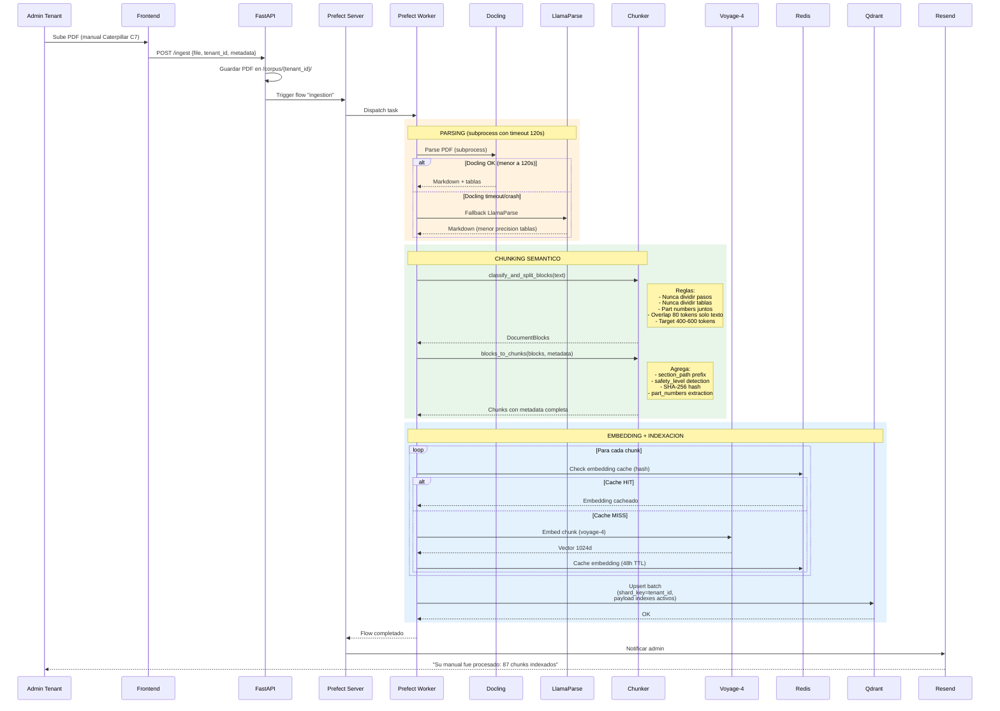
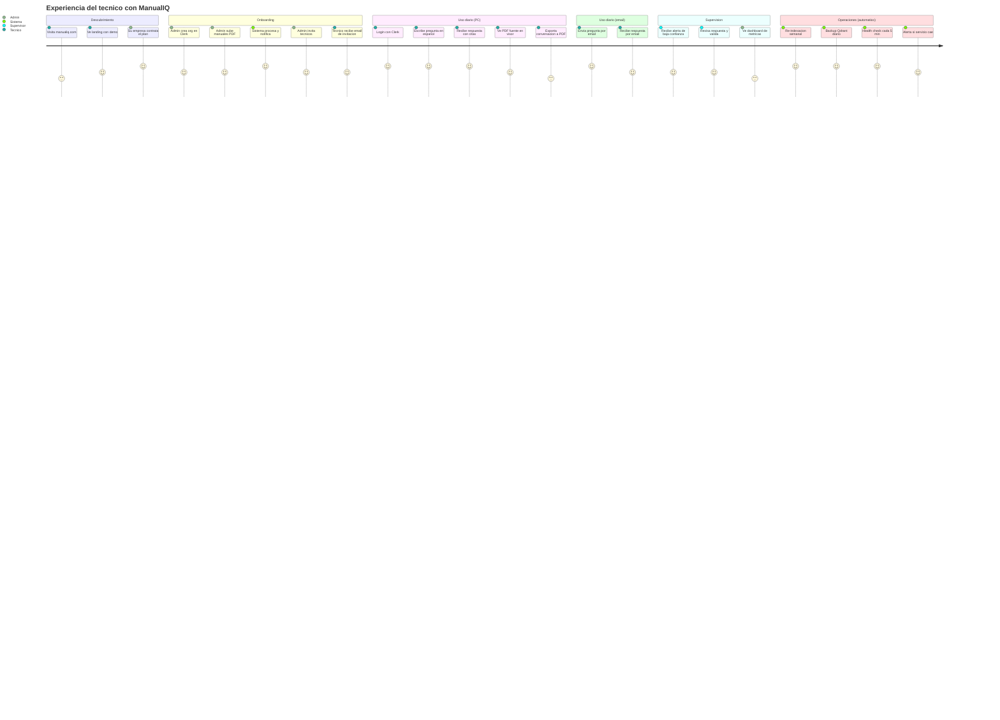
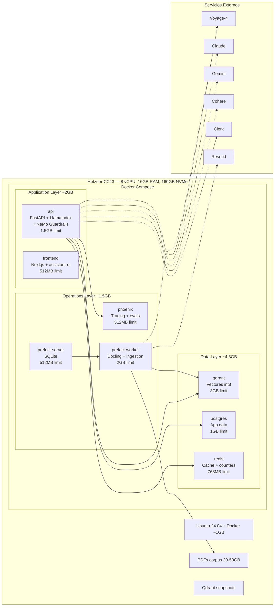

# ManualIQ — Diagramas de Arquitectura

> Diagramas Mermaid que describen como funciona el sistema, como se conectan
> los componentes, y como es la experiencia del usuario desde el landing
> hasta el uso diario.

---

## 1. Arquitectura general — Como se conectan los componentes

---

## 2. Flujo de una query — Desde que el tecnico pregunta hasta que recibe respuesta

---

## 3. Flujo de ingestion — Desde que el admin sube un PDF hasta que esta listo

---

## 4. Experiencia del usuario — Desde el landing hasta el uso diario

---

## 5. Distribucion en el VPS — Que corre donde

---

## 6. Flujos por canal de acceso

| Canal | Flujo |
|-------|-------|
| **Web (PC)** | Landing - Login Clerk - Chat UI - API - Pipeline RAG - Respuesta streaming + visor PDF |
| **Web (celular)** | Mismo flujo, responsive. Next.js adapta el layout. Instalable como PWA. |
| **Email** | Tecnico envia email a `consulta@empresa.manualiq.com` - API recibe (webhook Resend) - Pipeline RAG - Respuesta por email con citas + disclaimer. Latencia menor a 2 min. |
| **Admin** | Login - Panel de ingestion - Sube PDF - Prefect flow procesa - Notificacion cuando termina. Dashboard de metricas (post-MVP). |
| **Supervisor** | Recibe alertas automaticas cuando score menor a 0.75. Puede revisar la respuesta y el contexto en el historial. |
| **Operaciones** | Todo automatico via Prefect: re-indexacion semanal, backup diario, health check cada 5 min, alertas por email si algo cae. |

El canal de email es el unico que no pasa por el frontend — va directo al API via webhook de Resend. Todos los demas canales pasan por el frontend (Next.js) que se comunica con el API (FastAPI) que orquesta todo el pipeline RAG.
